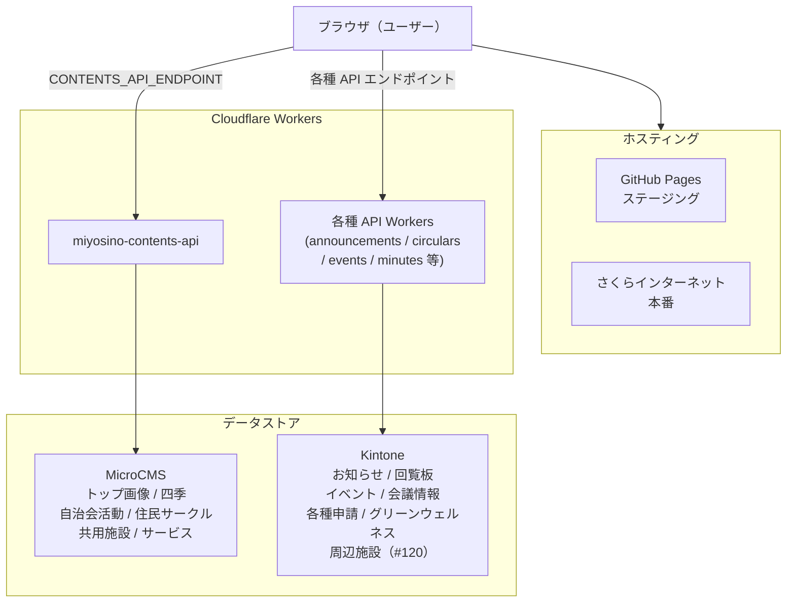
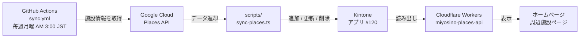

# システム全体像

## 構成図（通常のデータフロー）

## 構成図（周辺施設データ定期同期）

周辺施設情報のみ、Google Cloud（Places API）から定期的に取得してKintoneに書き込む別フローがあります。

詳細は [周辺施設データ同期（sync-places）](sync-places.md) を参照してください。

## 主要コンポーネント

| コンポーネント | 役割 | 技術 |
|--------------|------|------|
| フロントエンド | ページ表示・UI | Next.js 15 + React 19 + Tailwind CSS 4 |
| APIサーバー（コンテンツ） | MicroCMSへのプロキシ | Cloudflare Workers（miyosino-contents-api） |
| APIサーバー（組合員情報） | Kintoneへのプロキシ・認証 | Cloudflare Workers（各種） |
| コンテンツストア | ヒーロー画像・コミュニティ・施設等 | MicroCMS |
| データストア | 組合員向け情報管理 | Kintone（k-miyosino.cybozu.com） |
| 周辺施設同期 | Google Places → Kintone定期同期 | GitHub Actions + scripts/sync-places.ts |
| フォーム保護 | スパム対策 | Cloudflare Turnstile |
| アクセス解析 | Google Analytics | GA4（G-CF38V5SRBT） |

> **MicroCMSとKintoneの使い分け:** 公開ページのコンテンツ（画像・施設説明等）はMicroCMS、組合員専用ページの情報（お知らせ・回覧板等）はKintoneで管理しています。詳細は [MicroCMS](../05-known-issues/microcms.md) を参照してください。

## 通常のデータフロー

1. ユーザーがブラウザでホームページにアクセス
2. 静的ファイル（HTML/JS）がブラウザに読み込まれる
3. ブラウザのJavaScriptがCloudflare WorkersのAPIを呼び出す
4. CloudflareワーカーがKintone APIにアクセスしてデータを取得
5. ブラウザにデータが返り、ページに表示される

## 認証の仕組み

組合員専用ページのアクセス制御はカスタムToken認証で実現しています。  
詳細は [認証フロー](auth-flow.md) を参照してください。
