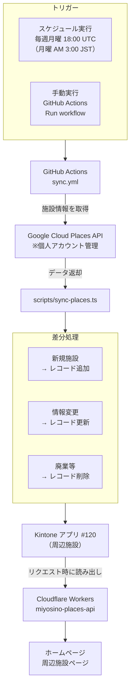

# 周辺施設データ同期（sync-places）

## 概要

ホームページの「周辺施設」ページに表示するデータは、Google Cloud Places APIから定期的に取得してKintone（アプリ #120）に書き込む仕組みで管理されています。

コンテンツ更新者がKintoneを手動で編集する必要はなく、**自動で最新のGoogle Maps情報が反映されます**。

---

## 同期フロー

---

## 関連ファイル

| ファイル | 役割 |
|---------|------|
| `scripts/sync-places.ts` | 同期スクリプト本体 |
| `.github/workflows/sync.yml` | GitHub Actionsワークフロー定義 |

---

## 必要な環境変数・シークレット

| 変数名 | 管理場所 | 内容 |
|--------|---------|------|
| `GOOGLE_PLACES_API_KEY` | GitHub Secrets | Google Places APIキー |
| `KINTONE_DOMAIN` | GitHub Secrets | `k-miyosino.cybozu.com` |
| `KINTONE_APP_ID_PLACES` | GitHub Secrets | Kintoneアプリ番号（120） |
| `KINTONE_API_TOKEN_PLACES` | GitHub Secrets | KintoneアプリのAPIトークン |

---

## Google Cloud の管理について

Google Places APIは**個人のGoogleアカウント**で管理されており、属人化のリスクがあります。  
詳細・対応方針は [Google Cloud属人化課題](../05-known-issues/google-cloud-singlepoint.md) を参照してください。

---

## 手動で同期を実行する方法

スケジュール実行を待たずに即時同期したい場合は、GitHubのActions画面から手動実行できます。

**手順1:** GitHubリポジトリの「Actions」タブを開きます。

**手順2:** 左側メニューの「Sync Places」をクリックします。

**手順3:** 「Run workflow」ボタンをクリックし、ブランチを選択して「Run workflow」を押します。

**手順4:** ワークフローが完了（緑のチェック）になったら同期完了です。

---

## 同期が失敗した場合

GitHub Actionsのログでエラー内容を確認してください。よくある原因:

| 原因 | 対処 |
|------|------|
| Google Places APIキーの期限切れ・無効 | Google Cloudコンソールで新しいAPIキーを発行し、GitHub Secretsを更新 |
| KintoneのAPIトークン期限切れ | Kintone管理画面でAPIトークンを再発行し、GitHub Secretsを更新 |
| Google Cloud の請求エラー | Google Cloudコンソールで請求状況を確認（[属人化課題](../05-known-issues/google-cloud-singlepoint.md)参照） |
