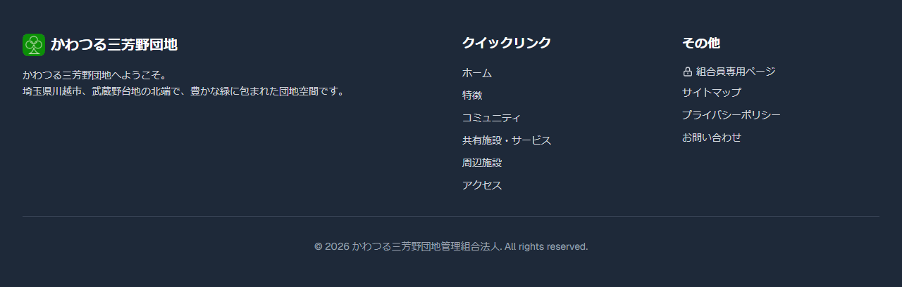

# 画面の各部の名前

ホームページの画面は、大きく3つの部分に分かれています。

---

## ヘッダー（画面の一番上）

画面の一番上にある横長の帯の部分を「**ヘッダー**」といいます。

ヘッダーには次のものがあります。

| 場所 | 内容 |
|------|------|
| 左側 | 団地のロゴ（クリックするとトップページに戻ります） |
| 中央 | ページへのリンク（特徴・コミュニティ・施設・アクセスなど） |
| 右側 | 「**組合員専用**」ボタン（青色）・「**お問い合わせ**」ボタン（緑色） |

> ヘッダーは画面をスクロールしても常に上部に表示されています。

---

## メインコンテンツ（中央の大きな部分）

ヘッダーとフッターの間にある部分が、そのページの主な内容です。

---

## フッター（画面の一番下）

画面の一番下にある部分を「**フッター**」といいます。

フッターには次のリンクがあります。

- **クイックリンク**: ホーム・特徴・コミュニティ・共有施設・周辺施設・アクセス
- **その他**: 組合員専用ページ・サイトマップ・プライバシーポリシー・お問い合わせ
- **著作権表記**: © 2026 かわつる三芳野団地管理組合法人

---

次のページ: [メニューの使いかた](navigation.md)
