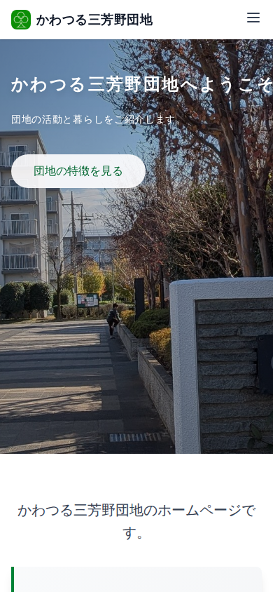
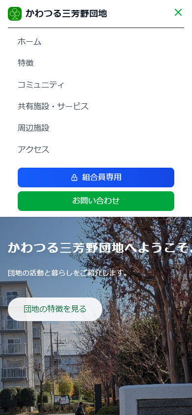

# スマートフォンで見る

ホームページはスマートフォン（スマホ）でもご覧いただけます。

---

## メニューの開きかた（スマートフォン）

スマートフォンでは、メニューが画面上部に横並びで表示されません。  
代わりに「**ハンバーガーメニュー**」を使います。

**ハンバーガーメニューとは:** 「≡」のような3本線のマークのことです。

**手順1:** 画面右上にある「≡」（3本線）のマークをタップします。

**手順2:** メニューが画面に表示されます。

**手順3:** 見たいページの名前をタップすると、そのページに移動します。

**手順4:** メニューを閉じるときは、「×」マークをタップします。

---

## 文字が小さくて読みにくい場合

スマートフォンの設定で文字を大きくできます。

### iPhoneの場合
「設定」→「アクセシビリティ」→「画面表示とテキストサイズ」→「さらに大きな文字」でサイズを調整できます。

### Androidの場合
「設定」→「ユーザー補助」→「フォントサイズ」でサイズを調整できます。

---

## ページを拡大して見るには

画面を指2本でつまむようにして広げる（ピンチアウト）と、画面を拡大できます。  
元に戻すときは、指2本でつまむように縮める（ピンチイン）と元のサイズに戻ります。

---

次のページ: [トップページ](../03-public-pages/home.md)
