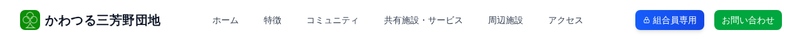

# メニューの使い方

## パソコンでのメニュー操作

画面上部のヘッダーに、ページへのリンクが横並びに表示されています。

見たいページの名前をクリックすると、そのページに移動します。

| メニュー名 | 内容 |
|-----------|------|
| ホーム | トップページに戻ります |
| 特徴 | 団地の特徴・魅力を紹介するページ |
| コミュニティ | 団地のコミュニティ活動を紹介するページ |
| 共有施設・サービス | 共有施設・サービスの案内ページ |
| 周辺施設 | 近くのスーパー・病院・公園などの情報ページ |
| アクセス | 団地への行き方を案内するページ |

### 組合員専用ページへ移動する

ヘッダー右側の青い「**組合員専用**」ボタンをクリックします。

ログインしていない場合は、ログイン画面に移動します（→ [ログインの方法](../04-login/how-to-login.md)）。

---

## 前のページに戻るには

ブラウザの「←（戻る）」ボタンをクリックすると、ひとつ前のページに戻ります。

または、ヘッダーのロゴ（左上）をクリックするとトップページに戻ります。

---

次のページ: [スマートフォンで見る](mobile.md)
