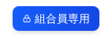
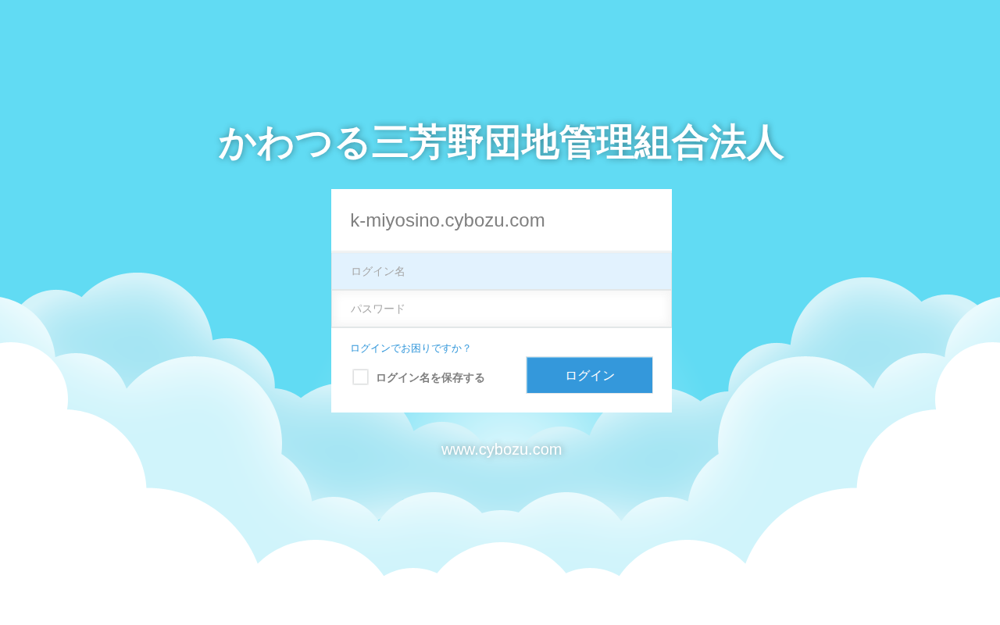

# ログインの方法

## 準備するもの

- **ID（ユーザー名）**: 事務局から配布された書類に記載されています
- **パスワード**: 同じ書類に記載されています

---

## ログイン手順

**手順1:** ヘッダー右側の青い「**組合員専用**」ボタンをクリックします。

**手順2:** ログイン画面が表示されます。

**手順3:** 「ID（ユーザー名）」の欄をクリックし、配布書類に記載されているIDを入力します。

**手順4:** 「パスワード」の欄をクリックし、パスワードを入力します。

> パスワードは「●●●●」のように隠れて表示されます。これは正常です。

**手順5:** 「**ログイン**」ボタンをクリックします。

**手順6:** 「組合員専用ページ」が表示されればログイン完了です。

---

## うまくいかない場合

### 「IDまたはパスワードが違います」と表示された場合

入力した内容を確認してください。

- 大文字・小文字を間違えていないか（「A」と「a」は別物です）
- 全角文字と半角文字を間違えていないか（「１」と「1」は別物です）
- スペース（空白）が入っていないか

それでも解決しない場合は [問い合わせ先](../06-trouble/contact-support.md) にご連絡ください。

---

次のページ: [ログアウトのしかた](logout.md)
