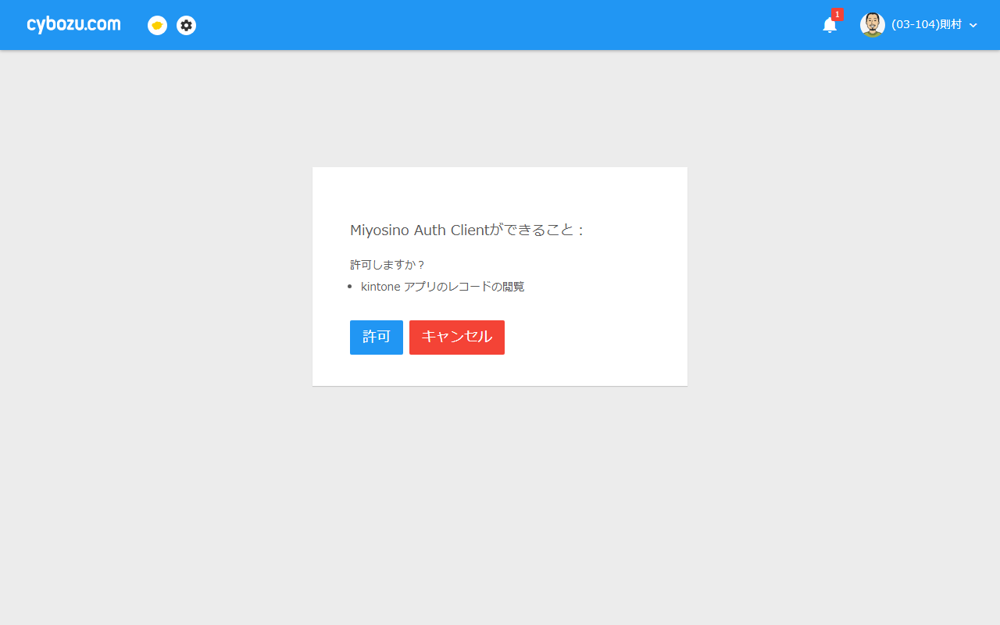

# ログアウトのしかた

使い終わったら、ログアウトしましょう。  
**特に共有のパソコンやスマートフォンをお使いの場合は、必ずログアウトしてください。**

---

## ログアウト手順

**手順1:** 組合員専用ページの右上にある「**ログアウト**」ボタンをクリックします。

**手順2:** ログアウトが完了し、トップページ（またはログイン画面）に戻ります。

---

## ページを閉じるだけでよいですか？

ブラウザを閉じただけでは、ログアウトされない場合があります。  
必ず「ログアウト」ボタンを押してからブラウザを閉じるようにしてください。

---

## 再度ログインしたい場合

ログアウト後に再度ログインしたい場合は、[ログインの方法](how-to-login.md) をご覧ください。
