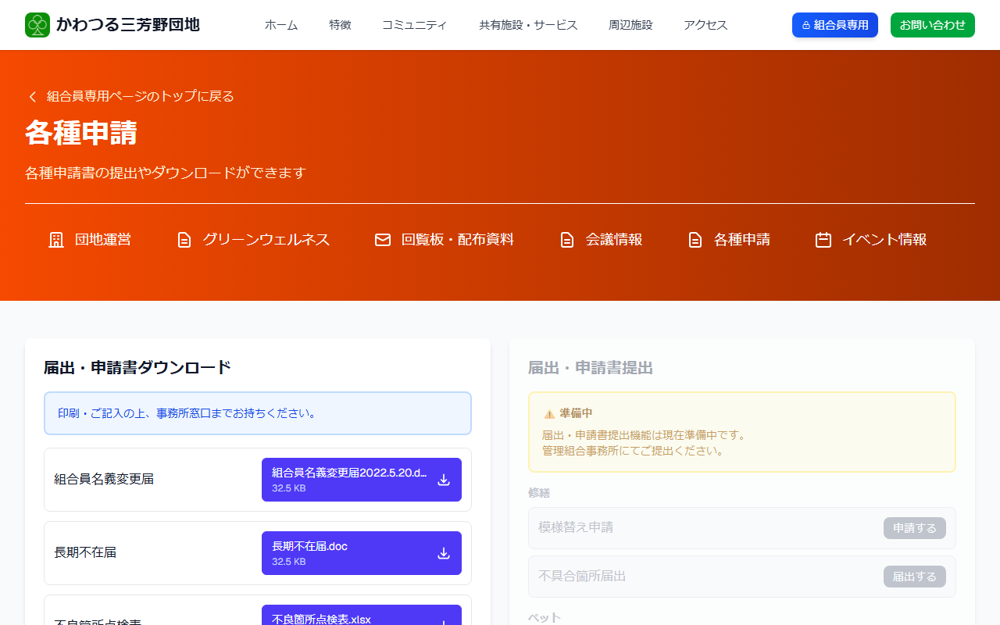

# 各種申請書をダウンロードする

各種申請書（PDFファイル）をダウンロードして、印刷してお使いいただけます。

---

## 申請書ページを開く方法

**手順1:** [ログイン](../04-login/how-to-login.md) して組合員専用ページを開きます。

**手順2:** 「**各種申請**」をクリックします。

---

## 申請書のダウンロード手順

**手順3:** 申請書の一覧が表示されます。

**手順4:** 必要な申請書の「ダウンロード」ボタンをクリックして保存します。

**手順5:** 印刷してご利用ください。

---

## 印刷できない場合

お近くのコンビニエンスストア（セブンイレブン・ローソン・ファミリーマートなど）のプリンターを使って印刷することもできます。

または、事務局に来局いただければ印刷した申請書をお渡しすることもできます。
