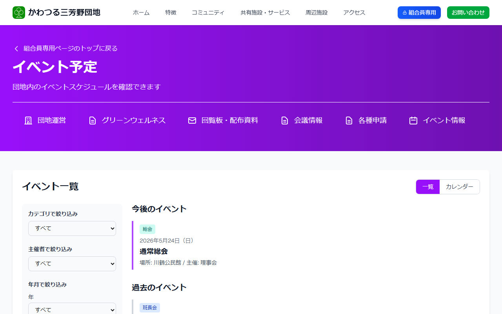
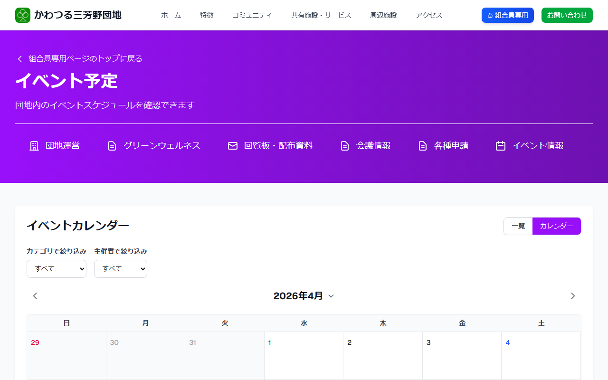

# イベント情報を見る

団地のイベント・行事の情報をご確認いただけます。

---

## イベント情報ページを開く方法

**手順1:** [ログイン](../04-login/how-to-login.md) して組合員専用ページを開きます。

**手順2:** 「**イベント情報**」をクリックします。

---

## イベント情報の見かた

**手順3:** イベントの一覧が表示されます。

**手順4:** 見たいイベントをクリックすると、日時・場所・内容などの詳細が表示されます。

---

## カレンダー表示の使いかた

「**カレンダー**」をクリックすると、カレンダー形式でイベントを確認できます。

月ごとのスケジュールを一目で把握したいときに便利です。
