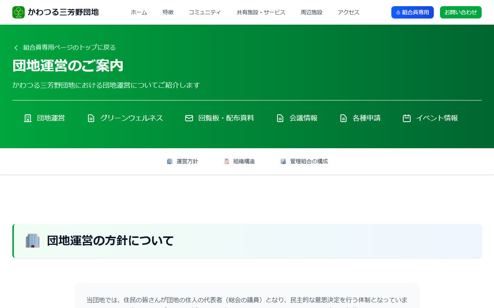

# 団地運営を見る

団地の運営方針や組織についての情報をご確認いただけます。

---

## 団地運営ページを開く方法

**手順1:** [ログイン](../04-login/how-to-login.md) して組合員専用ページを開きます。

**手順2:** 「**団地運営**」をクリックします。

---

## 団地運営情報の見かた

**手順3:** 運営方針や組織に関する情報が表示されます。

