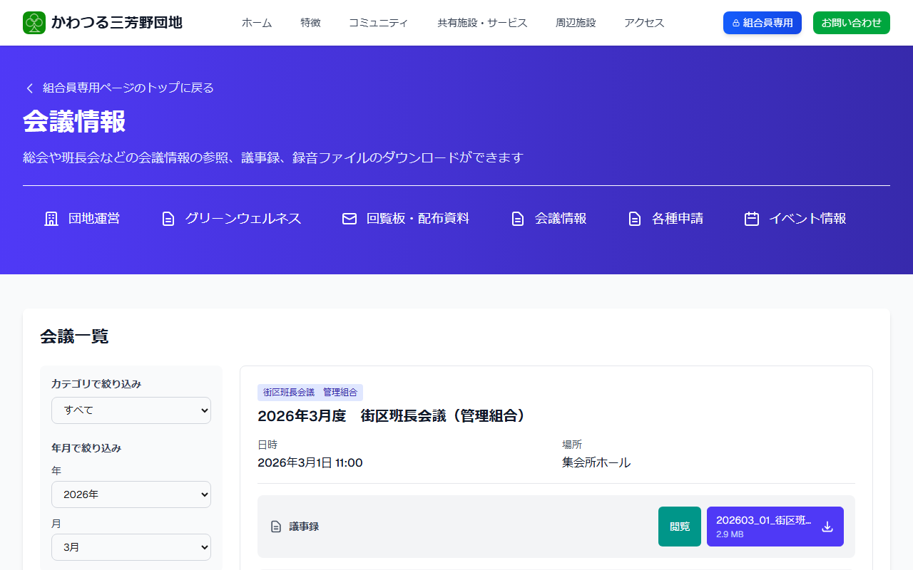
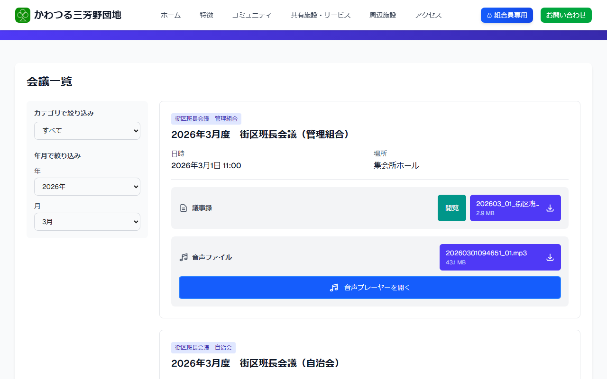

# 会議情報を見る

総会・理事会などの会議情報・議事録をご確認いただけます。

---

## 会議情報ページを開く方法

**手順1:** [ログイン](../04-login/how-to-login.md) して組合員専用ページを開きます。

**手順2:** 「**会議情報**」をクリックします。

---

## 会議情報の見かた

**手順3:** 会議の一覧が表示されます。

**手順4:** 見たい会議の各ボタンをクリックします。

- 「**閲覧**」をクリックすると、議事録の内容が表示されます。
- 「**音声プレーヤを開く**」をクリックすると、会議の録音を再生できます。
- 「**ダウンロード**」をクリックすると、ファイルを保存できます。
